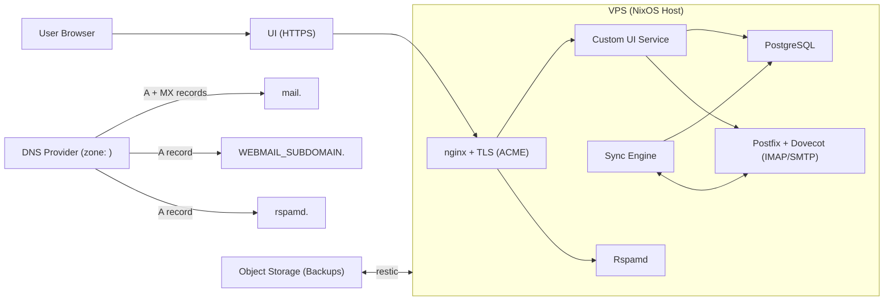

# Homerow Email

Self-hosted email with full control and a modern mail experience.

This repository provides a practical deployment path for running your own mail stack with a custom web interface, while keeping infrastructure explicit and reproducible.

## Why This Project Exists

This project started from a personal need: to have a modern email experience, but fully self-hosted and controlled by me.

I tested different options and mail stacks, but I could not find a solution that combined modern UX with a deployment flow that felt simple and understandable. Most paths were either hard to operate or not flexible enough.

So this repository became that path: a practical way to run your own email service with modern webmail, while keeping the infrastructure explicit and reproducible.

## How It Works

At a high level, this project has five parts working together:

1. Infrastructure provisioning (`infra/`): creates the VPS, DNS records, and backup storage using stack-based Terraform modules.
2. Server configuration (`flake.nix`, `modules/`): turns the VPS into a NixOS mail host with mail services, TLS, spam filtering, database, backups, and system services.
3. Sync layer (`sync-engine/`): keeps mailbox data synchronized into PostgreSQL so the UI can be fast and query-friendly.
4. Web interface (`webmail/`): custom frontend/backend service for daily email workflows.
5. Deploy orchestration (`scripts/install.sh`, `scripts/deploy.sh`, workflows): connects provider setup + NixOS deployment into one repeatable flow.

The core mail stack is provided by simple-nixos-mailserver, and this repository builds around it with automation and a modern UI layer.

## How Infrastructure Works

Infrastructure has three components:

- `VPS`: server where NixOS + mail/webmail services run
- `DNS`: domain records pointing mail/webmail/rspamd hosts to the server
- `Storage`: object storage for encrypted backups

Current supported providers:
- VPS: Hetzner
- DNS: Cloudflare
- Storage: Hetzner Object Storage

Provider-specific details and required secrets are documented in [`infra/PROVIDERS.md`](infra/PROVIDERS.md).

## What This Deploy Provisions

Running deploy does two big things: it provisions infrastructure, then configures the VPS as a complete mail platform.

At its core, this project builds on [simple-nixos-mailserver](https://nixos-mailserver.readthedocs.io/en/latest/setup-guide.html). The main additions in this repository are deployment automation and a custom webmail interface built specifically for this stack.

On the infrastructure side, it creates:
- one VPS (mail host),
- DNS records for mail/webmail/rspamd,
- one object storage bucket for backups.

On the server side (NixOS), it deploys:
- Postfix + Dovecot mail services through simple-nixos-mailserver,
- ACME/Let's Encrypt certificates,
- Rspamd spam filtering + web UI,
- nginx reverse proxy and TLS termination,
- PostgreSQL,
- the sync engine service (`sync-engine`),
- the webmail service (`webmail`),
- scheduled encrypted restic backups.

The webmail service includes a modern inbox workflow (threaded reading, compose flows, labels/categories, spam controls, takeout import support, and account security features such as 2FA), backed by the local sync engine and database.

If you are migrating from Gmail, see the [Gmail Migration Guide](https://docs.homerow.email/guides/gmail-migration/).
If you are deploying on Hetzner and need post-install mail setup guidance, see the [Hetzner Post-Install Guide](https://docs.homerow.email/guides/hetzner-post-install/).

## Sync Architecture (IMAP -> PostgreSQL -> Webmail)

The webmail frontend does not read directly from IMAP for every screen/action. Instead, this stack keeps a synchronized PostgreSQL copy of mailbox data through the sync engine.

Why this matters:
- IMAP is great as a protocol boundary, but not great as a low-latency UI query backend.
- Direct IMAP-driven UIs become slow on large folders and repeated navigation.
- Features like fast counts, threaded views, category-style views, and richer filtering are much easier when backed by a real database.

So the model here is similar to modern providers: IMAP remains the source protocol, while the product experience is served from a local indexed data store (PostgreSQL) that stays in sync.

## Architecture Diagram



In Cloudflare, record names are usually entered as subdomains (`mail`, `WEBMAIL_SUBDOMAIN`, `rspamd`), and Cloudflare expands them to full hostnames under your zone.

## Backups and Restore

Backups are built in two layers:
- Mail data + system state: restic snapshots of `/var/vmail`, `/var/lib/acme`, and `/var/lib/dhparams`.
- PostgreSQL (`mailsync`): local dump snapshots in `/var/backup/postgresql/<timestamp>/`, then included in the same restic run.

Backup schedule:
- `02:45` server time: `postgres-backup.service` creates:
  - `globals.sql` (roles/global objects)
  - `mailsync.dump` (custom-format DB dump)
- `03:00` server time: restic snapshot runs with daily/weekly/monthly retention.

Quick restore outline:
1. Restore snapshot data with restic (including `/var/backup/postgresql/...`).
2. Restore globals:
   - `sudo -u postgres psql -f /var/backup/postgresql/<timestamp>/globals.sql`
3. Recreate/restore database:
   - `sudo -u postgres dropdb --if-exists mailsync`
   - `sudo -u postgres createdb -O mailsync mailsync`
   - `sudo -u postgres pg_restore -d mailsync /var/backup/postgresql/<timestamp>/mailsync.dump`
4. Restart services:
   - `sudo systemctl restart postgresql mail-sync-engine custom-webmail-blue custom-webmail-green`

## `config.env` Variables

Use these tables as the reference for what goes into `config.env`.

### User Inputs

| Variable | Required | Purpose | Applies when |
| --- | --- | --- | --- |
| `DOMAIN` | Yes | Base domain used for mail/webmail/rspamd DNS and certificates. | Always |
| `EMAIL` | No | Admin mailbox/login email. Defaults to `admin@<DOMAIN>`. | Always |
| `MAIL_PASSWORD` | Yes | Mail admin password used by mailbox/auth bootstrap. | Always |
| `RESTIC_PASSWORD` | Yes | Encryption password for backups. | Always |
| `SSH_PRIVATE_KEY` | No | SSH private key content used for deploy/bootstrap (preferred, especially for CI/GitHub Actions). | Always |
| `ACME_ENV` | No | Certificate environment (`production` or `staging`). | Always (default `production`) |
| `WEBMAIL_SUBDOMAIN` | No | Webmail host subdomain. | Always (default `webmail`, must not be `mail`) |
| `SEED_INBOX` | No | Seed inbox messages after deploy/update (dev/test convenience). | Always (default `false`) |
| `SEED_INBOX_COUNT` | No | Number of SMTP seed messages when `SEED_INBOX=true`. | When `SEED_INBOX=true` (default `12`) |
| `SEED_INBOX_INCLUDE_CATEGORIES` | No | Also run UI category drag-and-drop assignments during seeding. | When `SEED_INBOX=true` (default `false`) |
| `VPS_STACK` | No | VPS provider stack selector. | Always (default `hetzner`) |
| `DNS_STACK` | No | DNS provider stack selector. | Always (default `cloudflare`) |
| `STORAGE_STACK` | No | Storage provider stack selector. | Always (default `hetzner-object-storage`) |
| `TF_STATE_BUCKET_NAME` | No | Dedicated bucket name for Terraform remote state setup. | Always (default `mail-tfstate-<domain>`) |
| `TF_STATE_PREFIX` | No | Key prefix inside the Terraform state bucket. | Always (default `<domain>`) |

`SEED_INBOX` runs `webmail/scripts/seed-e2e.mjs` right after deployment. By default it seeds via SMTP only (`SEED_INBOX_INCLUDE_CATEGORIES=false`), which is safer for staging/self-signed cert environments.

### Provider / Stack Variables

| Variable | Required | Purpose | Applies when |
| --- | --- | --- | --- |
| `HCLOUD_TOKEN` | Yes* | Hetzner Cloud API token. | When `VPS_STACK=hetzner` |
| `HETZNER_SERVER_TYPE` | No | Hetzner server plan/type. | When `VPS_STACK=hetzner` |
| `HETZNER_LOCATION` | No | Hetzner VPS datacenter/region. | When `VPS_STACK=hetzner` |
| `HETZNER_REUSE_EXISTING_SERVER` | No | Auto-reuse existing `mail-server` when detected (`true`/`false`). | When `VPS_STACK=hetzner` (default `true`) |
| `CLOUDFLARE_TOKEN` | Yes* | Cloudflare API token. | When `DNS_STACK=cloudflare` |
| `CLOUDFLARE_ZONE_ID` | Yes* | Cloudflare zone ID for your domain. | When `DNS_STACK=cloudflare` |
| `S3_ACCESS_KEY` | Yes* | Object storage access key for backups. | When `STORAGE_STACK=hetzner-object-storage` |
| `S3_SECRET_KEY` | Yes* | Object storage secret key for backups. | When `STORAGE_STACK=hetzner-object-storage` |
| `HETZNER_OBJECT_STORAGE_LOCATION` | No | Hetzner object storage region. | When `STORAGE_STACK=hetzner-object-storage` |

`Yes*` means required only for the selected stack/provider. As new providers are added, stack-specific variables can change. See [`infra/PROVIDERS.md`](infra/PROVIDERS.md) for provider details.

## Terraform State (How It Works Here)

This project keeps Terraform state in remote object storage for every deploy method (local Nix, Docker/Podman, and GitHub Actions). Terraform state is the source of truth for what was created, so it must persist between runs to keep plans, updates, and destroy operations reliable.

At deploy start, `scripts/install.sh` runs the `infra/terraform-state/<stack>` setup and creates the state bucket if needed (or reuses it if it already exists). After that, the VPS, DNS, and storage stacks initialize Terraform with that remote backend.

By default, state is stored in bucket `mail-tfstate-<domain>`, with separate keys per stack under `TF_STATE_PREFIX` (default: `<domain>`): `vps-<stack>.tfstate`, `dns-<stack>.tfstate`, and `storage-<stack>.tfstate`.

This also avoids runner-local state loss in CI environments, where filesystem state is ephemeral by design.

Keep state files out of git (`terraform.tfstate`, `*.tfstate.backup`) and keep the Terraform state bucket separate from the backups bucket.

If you need to force a fresh VPS (for example after keys were regenerated), set `HETZNER_REUSE_EXISTING_SERVER=false` to skip auto-reuse of an existing `mail-server`.
For a unified approach across local and GitHub Actions, set `SSH_PRIVATE_KEY` (content). Deploy uses that key directly.

## Expected Resource Sizing

For a single-account deployment, these are practical starting points:

| Profile | vCPU | RAM | Disk | Notes |
| --- | --- | --- | --- | --- |
| Minimum (test/small mailbox) | 2 | 4 GB | 40-60 GB SSD | Works for low traffic and light imports. |
| Recommended (daily personal use) | 2-4 | 8 GB | 80-160 GB SSD | Better for smoother indexing, sync, and webmail performance. |
| Heavy import / large history | 4+ | 8-16 GB | 200+ GB SSD | Useful for big Gmail Takeout imports and long retention. |

Storage planning:
- Local VPS disk stores mailboxes, database, attachments, and runtime state.
- Backup storage is separate object storage; size it at least to your expected mailbox footprint, usually with headroom for retention snapshots.

If you are unsure, start with the recommended profile and increase disk first as mailbox history grows.

You can customize machine and resource sizing directly in provider stack modules:
- VPS sizing: `infra/vps/hetzner/main.tf`
- DNS records: `infra/dns/cloudflare/main.tf`
- Backup storage settings: `infra/storage/hetzner-object-storage/main.tf`

## Deploy

### Project CLI

For a concise interface, use the project CLI:

```bash
./hrow help
```

Common commands:

```bash
./hrow deploy
./hrow destroy
./hrow ssh
./hrow push-secrets --repo <owner/repo>
./hrow e2e
./hrow docker deploy
```

### Option A: GitHub Actions

Use this if you prefer running deploy from GitHub instead of your local machine.

1. Fork this repository.
2. In your fork, set repository secrets required by deploy (same variable names shown in the `config.env` tables above, including `SSH_PRIVATE_KEY`).
3. Run workflow `Deploy Mail Server` in your fork.

Optional: easier secret setup
1. Clone your fork locally.
2. Create a local `config.env` (same format as Option B).
3. Configure the SSH key used by deploy:
   - This key is used for deploy/bootstrap and for later SSH admin access to your server.
   - Keep the private key secure and backed up.
   - You can reuse an existing key (for example `~/.ssh/id_ed25519`), or generate a dedicated one at any path you prefer:

```bash
ssh-keygen -t ed25519 -f ~/.ssh/homerow_ed25519 -N ""
```

4. Push secrets to your fork with:

```bash
./hrow push-secrets --repo <owner/repo> --ssh-key <path/to/private_key>
```

Example when using a dedicated key:

```bash
./hrow push-secrets --repo <owner/repo> --ssh-key ~/.ssh/homerow_ed25519
```

Example when reusing your default SSH key:

```bash
./hrow push-secrets --repo <owner/repo> --ssh-key ~/.ssh/id_ed25519
```

This convenience method requires GitHub CLI (`gh`) installed and authenticated (`gh auth login`).

Secret names match currently supported providers. Required variables are in the `config.env` table above and provider details are in [`infra/PROVIDERS.md`](infra/PROVIDERS.md).

On first deploy, the workflow runs the Terraform state setup step (create/import bucket), then stores stack state remotely there for all future runs.

SSH key note (all options): deploy always needs an SSH key. Preferred input is `SSH_PRIVATE_KEY` (content). For local convenience, you can also use `DEPLOY_SSH_PRIVATE_KEY_PATH` (file path).

### Option B: Docker/Podman (no local Nix required)

If you don’t want to install Nix locally, this is the simplest path.

1. Clone the repository and enter it:

```bash
git clone <repo-url>
cd homerow
```

2. Create `config.env` in the repo root (example for current default stacks):

```bash
DOMAIN=example.com
EMAIL=admin@example.com
MAIL_PASSWORD=change-me
RESTIC_PASSWORD=change-me

HCLOUD_TOKEN=...
CLOUDFLARE_TOKEN=...
CLOUDFLARE_ZONE_ID=...
S3_ACCESS_KEY=...
S3_SECRET_KEY=...

VPS_STACK=hetzner
DNS_STACK=cloudflare
STORAGE_STACK=hetzner-object-storage

ACME_ENV=production
WEBMAIL_SUBDOMAIN=webmail
HETZNER_SERVER_TYPE=cx23
HETZNER_LOCATION=nbg1
HETZNER_REUSE_EXISTING_SERVER=true
HETZNER_OBJECT_STORAGE_LOCATION=nbg1
```

3. Configure the SSH key used by deploy:
   - This key is used for deploy/bootstrap and for later SSH admin access to your server.
   - Keep the private key secure and backed up.
   - Reuse an existing key (for example `~/.ssh/id_ed25519`) or generate one at any path you prefer:

```bash
ssh-keygen -t ed25519 -f ~/.ssh/homerow_ed25519 -N ""
```

4. Make sure Docker or Podman is installed.
5. Run deploy (preferred: pass key content with `SSH_PRIVATE_KEY`):

```bash
SSH_PRIVATE_KEY="$(cat <path/to/private_key>)" ./hrow docker deploy
```

Advanced/local convenience:

```bash
DEPLOY_SSH_PRIVATE_KEY_PATH=<path/to/private_key> ./hrow docker deploy
```

On the first run, it builds the deploy image and then starts the full deployment.

### Option C: Local Nix / NixOS

If you already use Nix (or are on NixOS), you can run deploy directly:

1. Clone the repository and enter it:

```bash
git clone <repo-url>
cd homerow
```

2. Create `config.env` in the repo root (same format as Option B).
3. Configure the SSH key used by deploy (reuse an existing key or generate one):

```bash
ssh-keygen -t ed25519 -f ~/.ssh/homerow_ed25519 -N ""
```

4. Run deploy (preferred: pass key content with `SSH_PRIVATE_KEY`):

```bash
SSH_PRIVATE_KEY="$(cat <path/to/private_key>)" nix run .#deploy
```

If you want a fully prepared local shell first:

```bash
nix develop
./scripts/deploy-from-config.sh
```

Advanced/local convenience: instead of exporting key content, you can pass a key path:

```bash
DEPLOY_SSH_PRIVATE_KEY_PATH=<path/to/private_key> nix run .#deploy
```

`devenv.nix` includes deploy tools (`terraform`, `openssh`, `git`) for this path.

## After Deploy

Your deploy finishes with a working mail platform, but first-send deliverability still depends on post-deploy checks.

### What You Already Have

- Webmail UI at `https://<WEBMAIL_SUBDOMAIN>.<domain>` (default `https://webmail.<domain>`)
- Mail host at `mail.<domain>` (IMAP/SMTP services)
- Rspamd UI at `https://rspamd.<domain>`
- Login credentials: `EMAIL` + `MAIL_PASSWORD`
- DNS base records from infra stack (`A`, `MX`, `SPF`, `DMARC`) when using current defaults
- TLS certificates (ACME), backups, and sync engine running on the server

For Hetzner-specific post-install instructions, see the [Hetzner Post-Install Guide](https://docs.homerow.email/guides/hetzner-post-install/).

## Updates

- Current project version is in `VERSION`.
- Deploy prints a non-blocking update notice when upstream has a newer `v*` tag.
- For forks, set repository variable `UPSTREAM_REPO` (example: `guilhermeprokisch/homerow`) to enable scheduled upstream update checks via GitHub Actions.

## Destroy

Use destroy when you want to fully tear down this deployment and stop paying for the provisioned resources.

`./hrow destroy` will:
- destroy Terraform-managed storage, DNS, and VPS resources,
- remove local Terraform state/artifacts,
- remove local deploy keys and generated settings files.

This is destructive. After destroy, your server and mailbox data in that environment are no longer available unless you restore from backups.

```bash
./hrow destroy
```

## Tests

```bash
bash infra/tests/provider-selection-test.sh
bash infra/tests/deploy-from-config-test.sh
bash infra/tests/project-cli-test.sh
bash infra/tests/update-notice-test.sh
```

## Security

- Never commit `config.env`, private keys, or provider secrets.
- Rotate credentials regularly.
- Use `ACME_ENV=production` for trusted certificates.

## Add New Infrastructure Providers

See:
- [`infra/PROVIDERS.md`](infra/PROVIDERS.md)
- [`infra/README.md`](infra/README.md)
