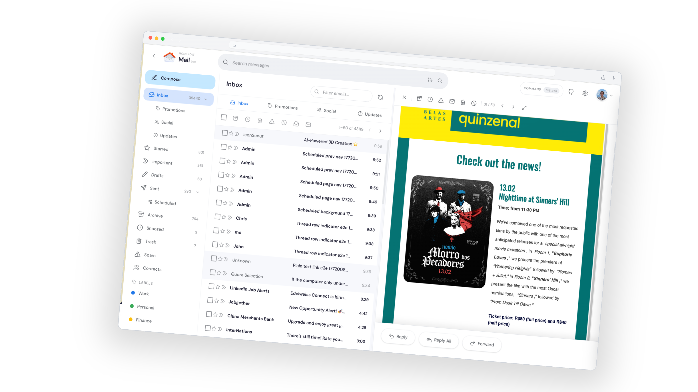

# 🏠 Homerow Mail

Self-hosted email with full control and a modern webmail experience.

This repository provides a practical path to provision infrastructure, deploy a NixOS mail server, and run a custom webmail stack.



## Documentation

Full docs: https://homerow.email
Demo: https://homerow.email/demo/

Key pages:
- Quick start: https://homerow.email/getting-started/quick-start/
- Configuration (`config.env`): https://homerow.email/getting-started/configuration/
- Remote deploy (GitHub Actions): https://homerow.email/deploy/github-actions/
- Local deploy (Docker/Podman or Nix/NixOS): https://homerow.email/deploy/local/
- Architecture overview: https://homerow.email/architecture/overview/
- Sync engine: https://homerow.email/architecture/sync-engine/
- Terraform state: https://homerow.email/infrastructure/terraform-state/
- Resource sizing: https://homerow.email/operations/resource-sizing/
- Backups and restore: https://homerow.email/operations/backups-restore/
- Security: https://homerow.email/operations/security/
- Updates: https://homerow.email/operations/updates/
- Destroy: https://homerow.email/operations/destroy/

## Deploy

### Option A: Remotely with GitHub Actions (Fork-and-Deploy)

> [!NOTE]
> `gh` CLI is required for this flow (`gh auth login`).

1. Fork this repository.
2. Create a local `config.env` (see Configuration docs above).
3. Deploy:

```bash
curl -fsSL https://raw.githubusercontent.com/guilhermeprokisch/homerow/main/scripts/fork-deploy.sh | bash -s -- --config ./config.env
```

This script does:
- Pushes all non-empty deploy values from `config.env` to your fork as GitHub repository secrets.
- Uploads `SSH_PRIVATE_KEY` from `SSH_PRIVATE_KEY_PATH`.
- Can trigger workflow `Deploy Mail Server` after secrets are uploaded.

### Option B: Locally

Shared setup:

1. Clone this repository.
2. Create `config.env` in repo root (see Configuration docs).
3. Set `SSH_PRIVATE_KEY_PATH` in `config.env`.

Docker/Podman:

```bash
./hrow deploy --via docker
```

Nix/NixOS:

```bash
./hrow deploy --via local
```

## Post-Deploy Guides

- After deploy checks: https://homerow.email/guides/after-deploy/
- Gmail migration: https://homerow.email/guides/gmail-migration/
- Hetzner post-install guide: https://homerow.email/guides/hetzner-post-install/

## Development Notes

- Never commit `config.env`, private keys, or provider secrets.
- Providers and stack notes: [infra/PROVIDERS.md](infra/PROVIDERS.md)
- Infra module details: [infra/README.md](infra/README.md)

## License

This project is licensed under the GNU Affero General Public License v3.0 only (`AGPL-3.0-only`). See the [LICENSE](LICENSE) file.
