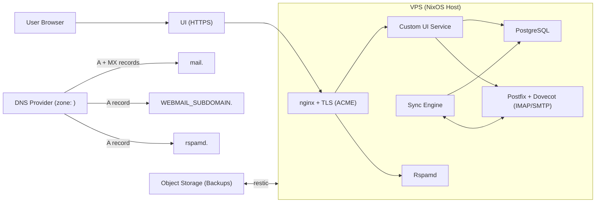

## Components

The stack has five layers:

1. **Infrastructure provisioning** (`infra/`) — Terraform modules create VPS, DNS records, and backup storage.
2. **Server configuration** (`flake.nix`, `modules/`) — NixOS declarative configuration for all services.
3. **Sync layer** (`sync-engine/`) — IMAP-to-PostgreSQL synchronization service.
4. **Web interface** (`webmail/`) — SolidStart frontend/backend for email workflows.
5. **Deploy orchestration** (`scripts/`) — installation and deployment automation.

## Architecture Diagram

## Services and Ports

| Service | Port | Protocol | Access | Purpose |
|---------|------|----------|--------|---------|
| Postfix (SMTP) | 465 | TLS | Mail clients | Send outgoing mail |
| Dovecot (IMAP) | 993 | TLS | Mail clients / sync-engine | Receive/store mail |
| Webmail | 3000 | HTTP | localhost (nginx proxy) | Web UI backend |
| nginx | 80, 443 | HTTP/HTTPS | Public | Reverse proxy, TLS termination |
| Rspamd UI | Unix socket | HTTP | nginx proxy | Spam filter admin panel |
| PostgreSQL | 5432 | TCP | localhost | Mail index database |

## NixOS Modules

Each module in `modules/` configures one aspect of the system:

- **`configuration.nix`** — Boot loader, networking, SSH access, firewall rules, Nix store optimization.
- **`disk-config.nix`** — GPT partitioning via Disko (boot + root partitions).
- **`mail.nix`** — Postfix, Dovecot, Rspamd, ACME/TLS certificates, nginx for Rspamd UI.
- **`backup.nix`** — Restic encrypted backups to S3 with daily schedule and retention policies.
- **`sync-engine.nix`** — PostgreSQL setup, sync engine systemd service, database schema initialization.
- **`webmail.nix`** — SolidStart app as systemd service, nginx reverse proxy with ACME.
- **`settings.nix`** — Runtime settings generated from deploy configuration.
