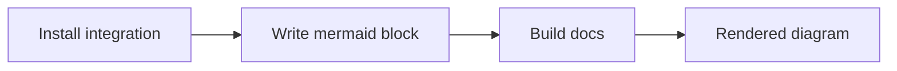

Mermaid is enabled in this docs site. You can add diagrams directly in Markdown code fences.

## Example

## Tips

- Keep node labels short so diagrams stay readable on mobile.
- Prefer left-to-right flowcharts (`flowchart LR`) for docs pages.
